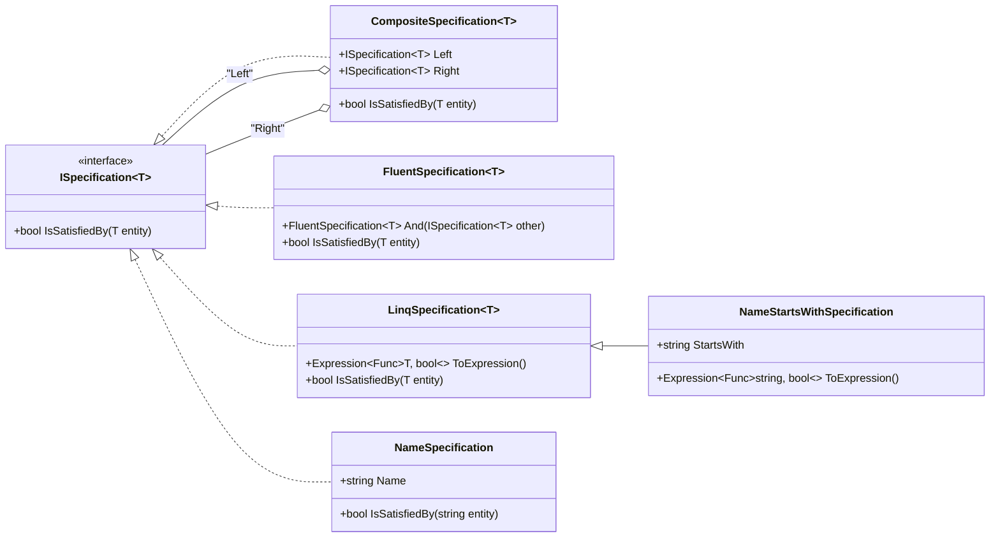

### Explicación del Diagrama
1. **ISpecification**: Es la interfaz común para todos los enfoques, definiendo el método `IsSatisfiedBy`.
2. **CompositeSpecification**: Implementa `ISpecification` y representa especificaciones compuestas con operadores lógicos como `And`, `Or`, etc.
3. **FluentSpecification**: Implementa `ISpecification` y añade métodos para construir especificaciones encadenadas.
4. **LinqSpecification**: Implementa `ISpecification` y agrega soporte para trabajar con expresiones LINQ.
5. **NameSpecification** y **NameStartsWithSpecification**: Son implementaciones específicas, donde `NameSpecification` es un ejemplo simple y `NameStartsWithSpecification` extiende `LinqSpecification` para aprovechar las expresiones.

